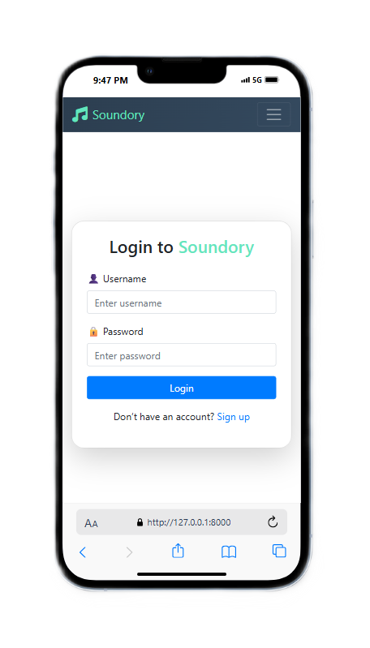

# 🎶 Soundory - Music & Podcast Web App

Soundory is a full-stack Django web application that allows users to explore and listen to trending songs, podcasts, and audiobooks. It features a personalized user profile, playlist management, and a sleek responsive UI.

---

## 🔥 Demo Screenshots

<table>
  <tr>
    <td>
       
      <b>Home Page</b>
    </td>
    <td>
       
      <b>Login Page</b>
    </td>
    <td>
       
      <b>Song Page</b>
    </td>
  </tr>
</table>

---

## 🚀 Features

- 🎵 Stream Songs & Add to Playlist  
- 🎙️ Explore Podcasts & Audiobooks  
- 📥 Download Audio Files  
- 🔐 User Authentication (Signup/Login)  
- ❤️ Watch Later Playlist  
- ✉️ Support Page with Email Integration  

---

## 🔧 Tech Stack

- **Backend**: Python, Django  
- **Frontend**: HTML, CSS, Bootstrap, JavaScript  
- **Database**: SQLite  
- **Other**: Pillow (for image handling), Gmail SMTP for email  

